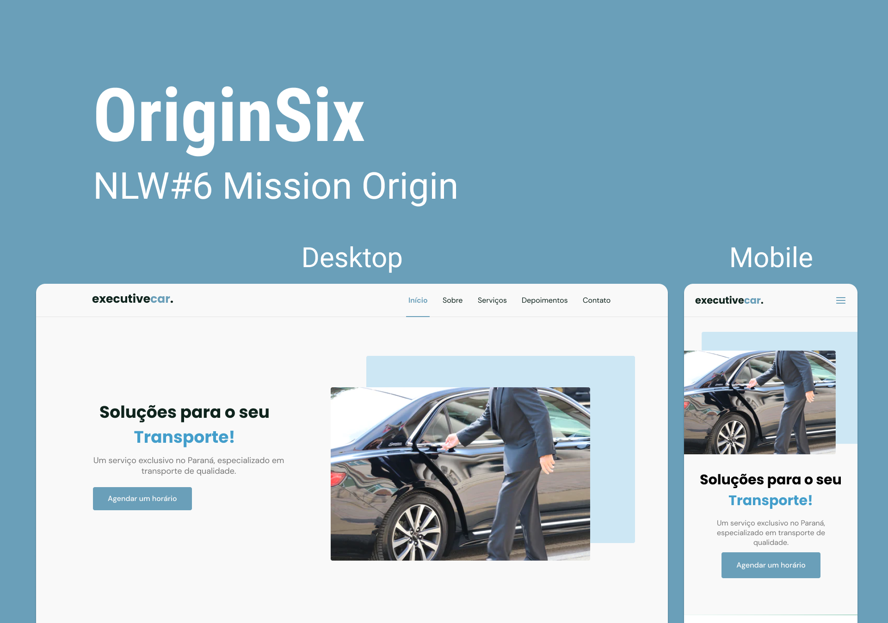

<h1 align="center">
  
</h1>

  <a href="#-tecnologias">Tecnologias</a>&nbsp;&nbsp;&nbsp;|&nbsp;&nbsp;&nbsp;
  <a href="#-projeto">Projeto</a>&nbsp;&nbsp;&nbsp;|&nbsp;&nbsp;&nbsp;
  <a href="#-layout">Layout</a>&nbsp;&nbsp;&nbsp;|&nbsp;&nbsp;&nbsp;
  <a href="#memo-licença">Licença</a>

 

  

 

  

## 🚀 Tecnologias

Esse projeto foi desenvolvido com as seguintes tecnologias:

- HTML
- CSS
- JavaScript
- Swiper
- Scrollreveal

## 💻 Projeto

O site executivecar. (acesse clicando [aqui](https://rsgabriel01.github.io/executivecar/)) é uma aplicação para divulgação de serviços e contatos através da internet baseado nos conteúdos ensinados na missao Origin da NextLevelWeek edição 6 fornecida pela [Rocketseat](https://rocketseat.com.br/).

## 🔖 Layout

Você pode visualizar o layout original do projeto através [desse link](https://www.figma.com/file/q35G3Q4xCmNxGJbarQfSpG/Origin-Six). É necessário ter conta no [Figma](https://figma.com) para acessá-lo.

## :memo: Licença

Esse projeto está sob a licença MIT. Veja o arquivo [LICENSE](.github/LICENSE.md) para mais detalhes.

---

Feito com ♥ junto com Rocketseat :wave: [Participe da comunidade!](https://discordapp.com/invite/gCRAFhc)
